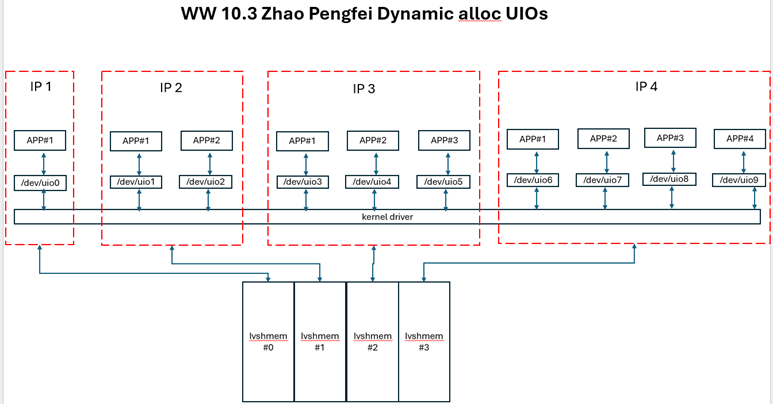
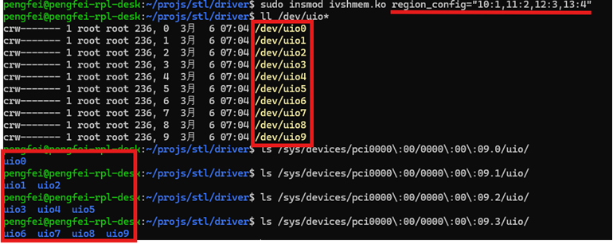

### The goal to be achieved

- One ivshmem can expose multiple UIOs
- Different ivshmems can expose different amounts of UIOs
- The number of UIOs exposed by each ivshmem can be customized and configured

### Example usage
For example, assuming the scenario is:
There are currently 4 IPs, each of which requires a separate ivshmem. Therefore, 4 ivshmem is required, and each app has its own unique UIO.

- IP # 1 (using ivshmem#0, region_id: 10) , if there is 1 APP in user mode, 1 UIO is required (uio0)
- IP # 2 (using ivshmem#1, region_id: 11), if there are 2 apps in user mode, 2 UIOs are required (uio1, uio2)
- IP # 3 (using ivshmem#2, region_id: 12), if there are 3 apps in user mode, 3 UIOs is required (uio3, uio4, uio5)
- IP # 4 (using ivshmem#3, region_id: 13), if there are 4 apps in user mode, 4 UIOs is required (uio7, uio8, uio9)

 

 
